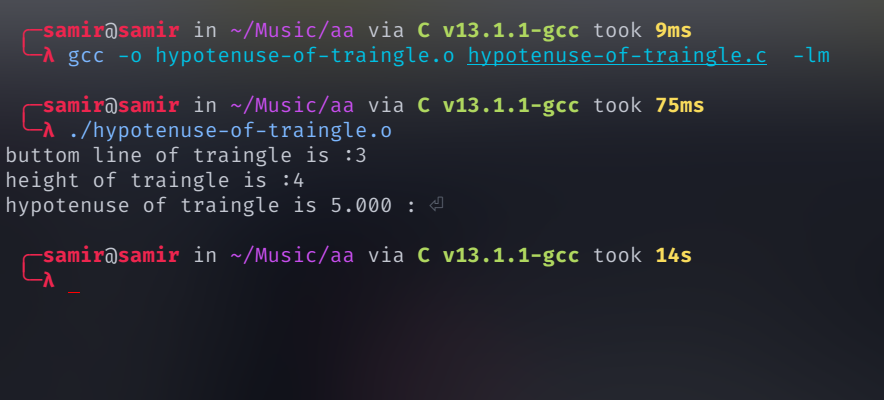

# Hypotenuse of traingle


## Run Locally

Clone the project

```bash
  git clone https://github.com/samirgaire10/hypotenuse-of-traingle.git
```

Go to the project directory

```bash
  cd hypotenuse-of-traingle
```

compile c file

```bash
gcc -o hypotenuse-of-traingle.o hypotenuse-of-traingle.c  -lm
```

Run 
```bash
./hypotenuse-of-traingle.o
```
## Screenshots


